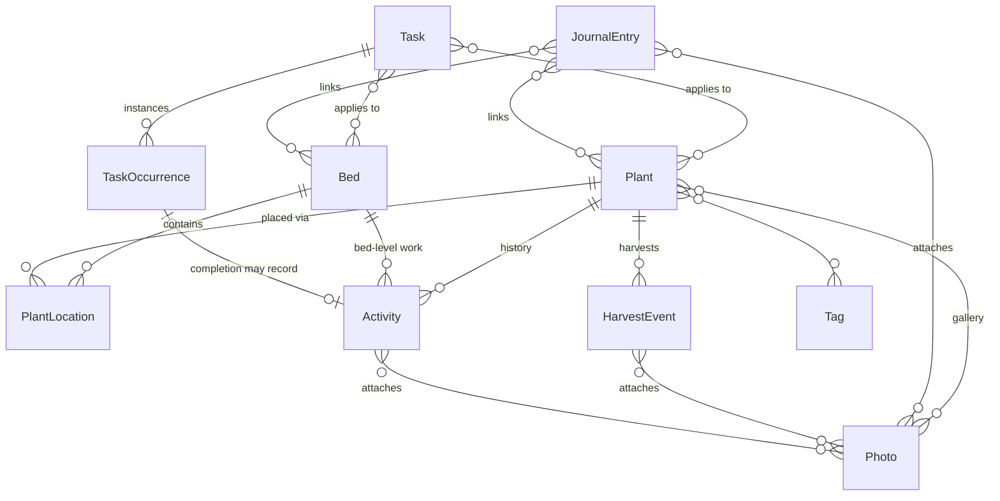

# YardWise MVP schema design

Design for issue #2. Reviewed before implementation. Django models; names below
are model names, tables get Django's default naming.

Guiding constraints, from [scope.md](../scope.md) "Data-model rules honored now":
photos are shared assets, archive-never-delete, stable bed IDs, plant identity
separable from placement, uncertainty is a valid state (nullable > fake default).

## Entity overview

Plus user-editable vocabulary tables (bottom of this doc) referenced by most
entities.

## Bed

The stable location registry. No geometry in MVP; the Property Map module later
adds polygon/grid columns to this same table — nothing here needs to change.

| Field | Type | Notes |
|---|---|---|
| `code` | char, unique, immutable | `BED-001` style, assigned by sequence at creation, **never reused or changed** (R-014). This is what history hangs off. |
| `name` | char, unique among non-archived | Display name; renames touch only this (R-018). Duplicate names prompt, not fail silently (PDD 4.3). |
| `short_code` | char, optional, unique | `FEB`, `BB1` for compact display |
| `bed_type` | FK BedType, nullable | user-editable vocabulary |
| `sun_notes` / `soil_notes` / `irrigation_notes` / `notes` | text, blank | free text; structured irrigation belongs to the deferred module |
| `archived_at` | datetime, nullable | archive-not-delete |

## Plant

The **specimen** record: a thing growing (or that grew) on the property.

The PDD separates reusable species/cultivar facts (Variety) from specimens, but
that split only pays for itself with annual crops (Garden Planner module). MVP
carries species-level facts as columns on Plant, grouped below so the future
`Variety` extraction is a mechanical "move these columns" migration. Annual
crops entered during MVP are just Plants; the planner module migrates them.

Identity/care fields (future Variety candidates): `common_name` (required —
the only mandatory field, AC-124), `botanical_name`, `cultivar`, `plant_type`
(FK vocabulary), `is_edible`, `is_ornamental`, `evergreen_deciduous` (enum,
nullable), `sun` (enum full/part/shade, nullable), `water_needs` (enum,
nullable), `soil_notes`, `mature_height` / `mature_width` (text — "6-8 ft"
beats a fake-precise decimal), `bloom_window` / `harvest_window` /
`prune_window` / `fertilize_window` (each a SeasonWindow FK, nullable),
`toxicity_notes`.

Specimen fields: `planted_on` (date, nullable) + `planted_precision` (enum
`exact|month|year`, for "planted sometime in 2019"), `source` (nursery etc.),
`status` (enum `active|archived|removed|died` — archived plants keep all
history, R-097), `notes`, `primary_photo` (FK Photo, nullable),
`is_favorite` (bool), `watch_reason` (char, blank; non-blank = watched —
feeds Today, PDD 2.8), `tags` (M2M Tag), `photos` (M2M Photo),
`created_by` (FK user), `archived_at`.

## PlantLocation

Placement is its own record, not a column on Plant — this is the canonical
identity-vs-placement rule, and it gives us location history and
multi-location plants (R-032, R-033) for free.

| Field | Type | Notes |
|---|---|---|
| `plant` | FK Plant | |
| `bed` | FK Bed, nullable | nullable = "somewhere on the property, no bed yet" — progressive entry |
| `location_note` | char, blank | "north edge, fence side" (PDD 4.5) |
| `is_current` | bool | moving a plant ends the old row (`ended_on`), creates a new current row |
| `is_primary` | bool | one primary among current rows when there are several |
| `started_on` / `ended_on` | date, nullable | date entered/left when known |

The map module later adds an exact-point column here; bed+note is the MVP
resolution.

## Photo

One row per uploaded image, linked from many places, stored once (R-068).
Explicit M2M tables per record type (`Plant.photos`, `JournalEntry.photos`,
`Activity.photos`, `HarvestEvent.photos`) rather than a generic-FK link table:
typed joins, DB-level integrity, and much friendlier for a future maintainer
reading the code. Future modules add their own M2M to Photo.

| Field | Type | Notes |
|---|---|---|
| `file` | image | original, on the photos volume; web/thumb derivatives generated on upload (issue #11) |
| `taken_on` | date, nullable | from EXIF when present, always user-editable (AC-058) |
| `season` | enum winter/spring/summer/fall, nullable | suggested from `taken_on`, user-overridable |
| `year` | int, nullable | denormalized from `taken_on` for the Year/Season views (PDD 5.4) |
| `caption` | char, blank | |
| `categories` | M2M PhotoCategory | seeded with the PDD 5.2 list, user-extendable |
| `uploaded_by` / `uploaded_at` | | |

Deletion: a Photo row is only deletable when nothing links it; UI offers
"remove from this plant" (unlink) as the normal verb.

## Activity

A completed piece of garden work — the durable history the PDD cares most
about. Either plant-scoped or bed-scoped (mulching a whole bed), at least one
required.

| Field | Type | Notes |
|---|---|---|
| `plant` | FK Plant, nullable | |
| `bed` | FK Bed, nullable | check constraint: `plant` or `bed` set |
| `activity_type` | FK ActivityType | seeded: Pruned, Fertilized, Watered, Sprayed/Treated, Transplanted, Divided, Planted, Mulched, Pest/Disease Check, Other |
| `performed_on` | date | defaults today |
| `note` | text, blank | |
| `photos` | M2M Photo | |
| `created_by` | FK user | |

Harvests are **not** Activities — they're `HarvestEvent`s with their own
structure. The profile timeline interleaves both by date.

## Task and TaskOccurrence — the horticultural timing model

The PDD's central scheduling insight: a gardening job has a *window*, not
always a *date*, and completing a recurring job must preserve the completed
instance (AC-126). So: **Task** is the durable definition, **TaskOccurrence**
is each concrete instance that appears on Today and gets completed.

### Task

| Field | Type | Notes |
|---|---|---|
| `title` | char | |
| `notes` | text, blank | |
| `category` | FK TaskCategory, nullable | user-editable vocabulary |
| `priority` | enum high/medium/low | default medium |
| `plants` | M2M Plant | applies-to: any combination of |
| `beds` | M2M Bed | plants, beds, and/or a tag |
| `tag` | FK Tag, nullable | "all plants tagged `roses`" — resolved at occurrence display time, not frozen |
| `schedule_kind` | enum, below | |
| `due_on` | date, nullable | EXACT kinds |
| `window` | FK SeasonWindow, nullable | WINDOW kinds ("Late winter") |
| `interval_count` / `interval_unit` | int / enum days-weeks-months | INTERVAL kind |
| `interval_anchor` | enum `after_completion` \| `fixed` | PDD: "every N ... after completion or from a fixed anchor" |
| `archived_at` | datetime, nullable | |

`schedule_kind` enumerates the *valid* combinations instead of letting three
orthogonal fields form invalid ones:

- `EXACT_ONCE` — due March 15, done.
- `EXACT_YEARLY` — due March 15 every year.
- `WINDOW_ONCE` — do once, sometime in late winter.
- `WINDOW_YEARLY` — every late winter (the classic "prune yearly" case).
- `INTERVAL` — every N days/weeks/months, next computed from completion date
  (or from a fixed anchor), inherently recurring.

(The PDD also lists "monthly"; that is `INTERVAL` with unit=months.)

### TaskOccurrence

| Field | Type | Notes |
|---|---|---|
| `task` | FK Task | |
| `due_on` | date, nullable | EXACT and INTERVAL occurrences |
| `window_start` / `window_end` | date, nullable | WINDOW occurrences, resolved to concrete dates for that year from the SeasonWindow definition |
| `status` | enum `pending|completed|skipped` | skipped = user said "not this year", preserved in history |
| `completed_on` | date, nullable | actual completion date (may differ from due) |
| `completion_note` | text, blank | |
| `activity` | FK Activity, nullable | completing can record an Activity in one step |

**Lifecycle, no cron**: creating a Task materializes its first occurrence.
Completing (or skipping) an occurrence synchronously computes and creates the
next one for recurring kinds — yearly kinds advance a year, `INTERVAL`
adds N units to `completed_on` (or the anchor). Everything Today needs already
exists as rows; no scheduler, no background jobs. Overdue = `due_on` past
(EXACT/INTERVAL) or `window_end` past (WINDOW); "due now" for a window task =
today inside the window.

## JournalEntry

| Field | Type | Notes |
|---|---|---|
| `occurred_at` | datetime | auto now, editable |
| `text` | text | |
| `photos` | M2M Photo | |
| `plants` | M2M Plant | entry appears on each linked plant's profile |
| `beds` | M2M Bed | |
| `tags` | M2M Tag | weather, bloom, project, observation... |
| `created_by` | FK user | |

The Plant Wish List (PDD 5) rides with the Garden Planner module, not MVP —
it's research/planning data with its own enrichment lifecycle.

## HarvestEvent

| Field | Type | Notes |
|---|---|---|
| `plant` | FK Plant | history survives plant archival (R-097: FK to archived plants stays valid) |
| `harvested_on` | date | defaults today |
| `quantity` | decimal, nullable | only date is required (R-093) |
| `unit` | FK HarvestUnit, nullable | seeded: fruit, lbs, oz, baskets, cups, bunches, handfuls; user-extendable |
| `count` | int, nullable | optional count alongside weight (PDD 6: "count plus weight when both are useful") |
| `quality` | enum poor/fair/good/excellent, nullable | |
| `intended_use` | char, blank | fresh, preserving, freezing, gifting... |
| `notes` | text, blank | |
| `photos` | M2M Photo | |

Season totals (AC-078) are computed queries grouped by year and unit — never
stored, so corrections (R-096) can't desync a rollup.

## Vocabulary tables (Settings screen, PDD "user-controlled vocabulary")

`PlantType`, `BedType`, `ActivityType`, `TaskCategory`, `HarvestUnit`,
`PhotoCategory`, `Tag` — all the same shape: `name` (unique), `is_builtin`
(seeded rows, protected from deletion but renamable), `archived_at`.

`SeasonWindow` is the interesting one: `label` ("Late winter"), `start_month`,
`start_day`, `end_month`, `end_day`; windows may cross the year boundary
(Nov 15 - Feb 28). Seeded with early/mid/late x four seasons using PNW-sensible
defaults, all editable (PDD Settings: "season definitions/preferences") — plus
user-defined custom ranges. Tasks and plant care windows both reference it, so
adjusting "late winter" once adjusts everything that uses it.

## Cross-cutting decisions

- **Users**: Django auth via Authentik OIDC. One shared garden — no per-row
  ownership or visibility; `created_by` is provenance only.
- **Archival**: `archived_at` timestamps, default managers exclude archived,
  nothing user-facing does hard deletes (Photo unlink/delete is the one
  narrow exception above).
- **Fuzzy dates**: wherever "approximately when" matters (`planted_on`), a
  companion precision enum instead of fake-exact dates.
- **AI readiness (deferred, by design)**: field-level provenance
  (User Entered vs AI Suggested, R-140s) will arrive as a sidecar table
  `FieldProvenance(record_type, record_id, field, source, locked_at)` in the
  AI module — no MVP columns needed now, documented so the AI module doesn't
  invent per-field columns instead.
- **IDs**: Django default integer PKs everywhere; `Bed.code` is the only
  business-facing stable identifier the PDD demands. QR/NFC opaque IDs
  (R-004) are a deferred-module concern and can key off PKs + a signed slug
  later.
